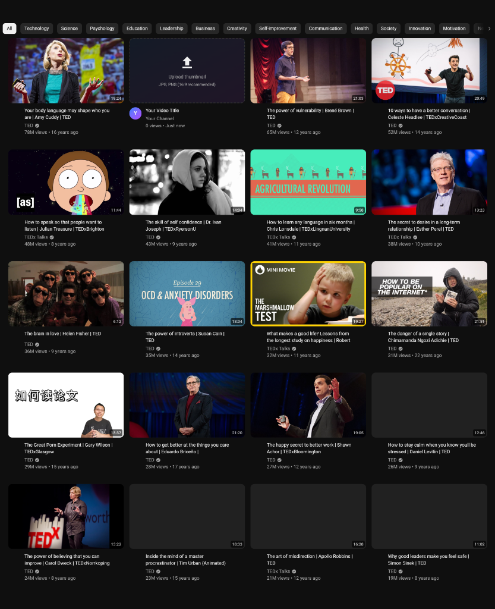

# YouTube Mockup Design/ Youtube Thumbnails Previewer

Client-side tool to preview your YouTube thumbnails in context before uploading. 
See exactly how your thumbnails will appear on YouTube's home page, search results, and watch page.

[[clause] if something like this exists or a dev wants to build it, i will delete this project]




## ✨ Features

- **Multiple Views** - Preview in Home page grid, Search results list, and Watch page player
- **Drag & Drop** - Simply drag your thumbnail onto the mockup
- **Edit Everything** - Customize title, channel name, and avatar
- **Export** - Save high-quality PNG or JPEG screenshots
- **Undo/Redo** - Full history support for all changes
- **100% Private** - Everything runs locally in your browser

## 🔒 Privacy & Security

This app is designed with privacy in mind:

- ✅ **No data uploaded** - Your thumbnails never leave your browser
- ✅ **No tracking** - No analytics, cookies, or user tracking
- ✅ **No accounts** - No sign-up required
- ✅ **Client-side only** - All processing happens in your browser
- ✅ **Local storage** - Your data is saved only to your browser's localStorage

## 🚀 Getting Started

### Use Online

Visit the deployed version to use the app directly.

### Run Locally

```bash
# Clone the repository
git clone https://github.com/aAndy03/mockup-thumbnail-youtube.git
cd mockup-thumbnail-youtube

# Install dependencies
npm install

# Start development server
npm run dev

# Build for production
npm run build
```

## 🎨 Usage

1. **Upload Thumbnail** - Drag and drop or click to upload your thumbnail
2. **Edit Details** - Click on the title and channel name to edit
3. **Switch Views** - Use the floating toolbar to switch between Home, Search, and Watch views
4. **Export** - Click the export button to save a screenshot

## ⌨️ Keyboard Shortcuts

| Action | Shortcut |
|--------|----------|
| Undo | `Ctrl/Cmd + Z` |
| Redo | `Ctrl/Cmd + Shift + Z` |

## 🛠️ Tech Stack

- **React 19** - UI framework
- **TypeScript** - Type safety
- **Vite** - Build tool
- **Tailwind CSS v4** - Styling
- **Framer Motion** - Animations
- **Zustand** - State management
- **Zod** - Schema validation

## 📁 Project Structure

```
src/
├── components/       # React components
│   ├── Header.tsx
│   ├── Sidebar.tsx
│   ├── VideoCard.tsx
│   ├── MockVideoCard.tsx
│   ├── WatchPage.tsx
│   └── ...
├── stores/           # Zustand stores
├── lib/              # Utilities
│   ├── thumbnail.ts  # Image processing
│   ├── storage.ts    # LocalStorage helpers
│   ├── security.ts   # Security utilities
│   └── schemas.ts    # Zod schemas
└── data/             # Static data
```

## 🤝 Contributing

Contributions are welcome! Please feel free to submit a Pull Request.

1. Fork the repository
2. Create your feature branch (`git checkout -b feature/amazing-feature`)
3. Commit your changes (`git commit -m 'Add amazing feature'`)
4. Push to the branch (`git push origin feature/amazing-feature`)
5. Open a Pull Request

## 📄 License

This project is licensed under the MIT License - see the [LICENSE](LICENSE) file for details.

## 🙏 Acknowledgments

- The React, Vite, TanStack, Zustand, Tailwind CSS, and Framer Motion communities
- All contributors and users

## 🤖 Developed with AI

This project was developed with assistance from:

- **Antigravity** - Advanced Agentic Coding by Google DeepMind
- **Claude Opus 4.5 Thinking** by Anthropic

## ⚠️ Disclaimer

This is an independent project. **Neither YouTube, Google DeepMind, Anthropic, nor the libraries mentioned above officially endorse this product.** YouTube is a trademark of Google LLC.

---

Made with ❤️ for content creators (and AI 🤖)
